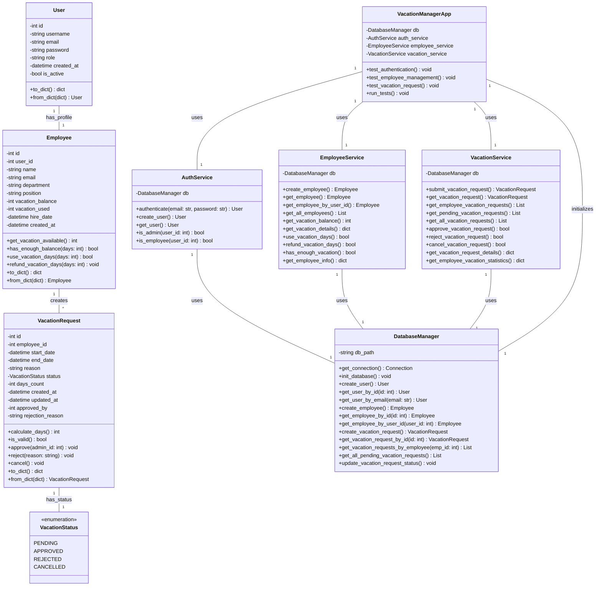
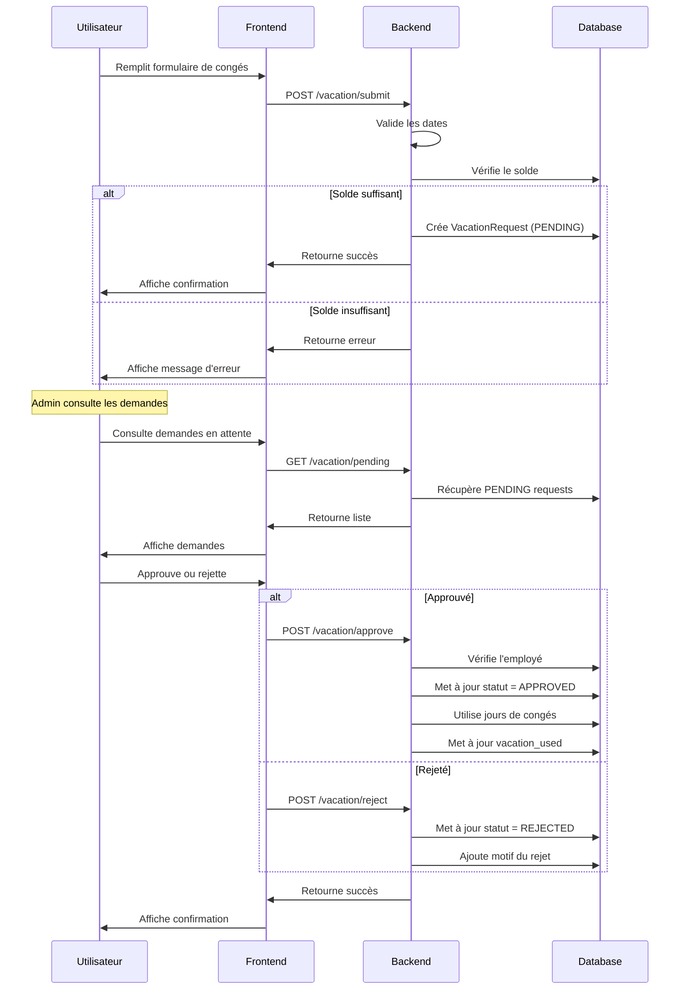
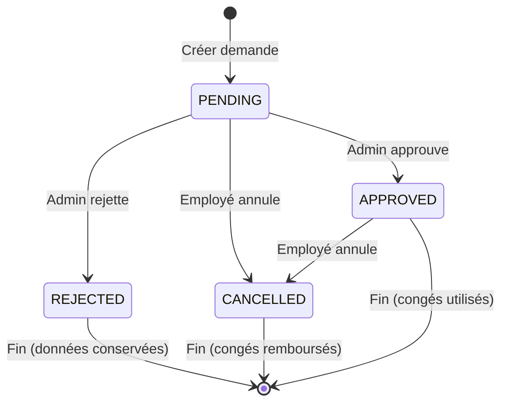
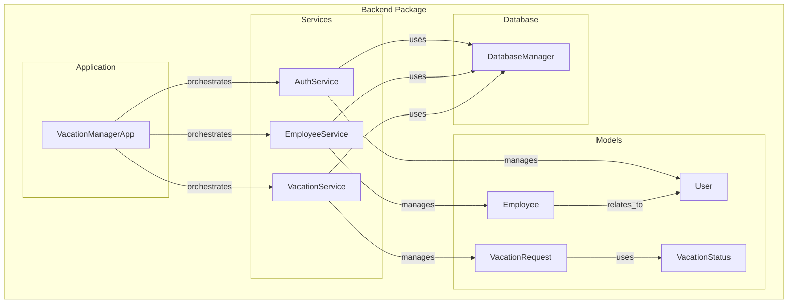
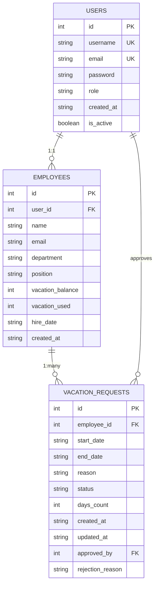
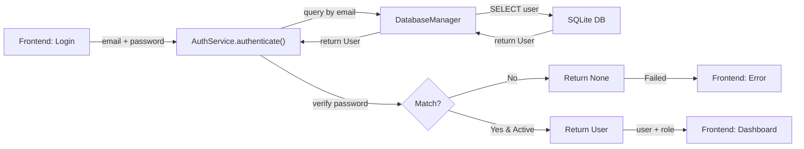
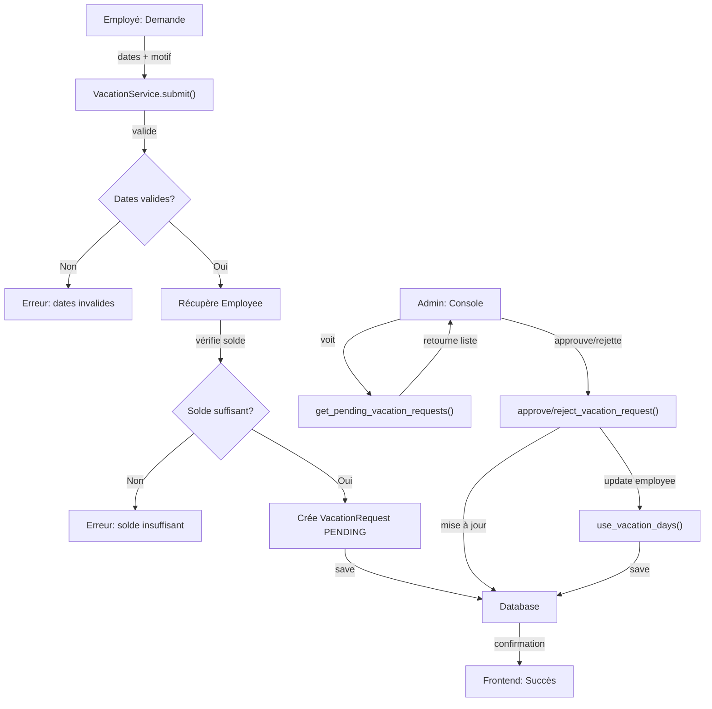

# 📊 Diagramme UML - Architecture du Backend

## Diagramme de Classes



## Diagramme de Flux - Processus de Demande de Congés



## Diagramme d'État - Demande de Congés



## Architecture en Couches

```
┌─────────────────────────────────────┐
│         Frontend (React)             │
│  (Interfaces Figma)                  │
└──────────────┬──────────────────────┘
               │ API HTTP/JSON
┌──────────────▼──────────────────────┐
│         Services Layer               │
│  - AuthService                       │
│  - EmployeeService                   │
│  - VacationService                   │
└──────────────┬──────────────────────┘
               │ Métier
┌──────────────▼──────────────────────┐
│         Models/Domain Layer          │
│  - User                              │
│  - Employee                          │
│  - VacationRequest                   │
└──────────────┬──────────────────────┘
               │ Persistance
┌──────────────▼──────────────────────┐
│      Database Manager                │
│  (SQLite - vacation_manager.db)      │
└──────────────┬──────────────────────┘
               │ SQL
┌──────────────▼──────────────────────┐
│          SQLite Database             │
│  - users                             │
│  - employees                         │
│  - vacation_requests                 │
└─────────────────────────────────────┘
```

## Package Diagram



## Modèle de Données - Schema SQLite



## Flux d'Authentification



## Flux de Gestion des Congés



Maintes correspondances avec les spécifications:
- ✅ Classes Python bien structurées
- ✅ POO avec encapsulation
- ✅ Relations cohérentes
- ✅ Gestion centralisée des données
- ✅ Services métier découplés
- ✅ Architecture en couches
